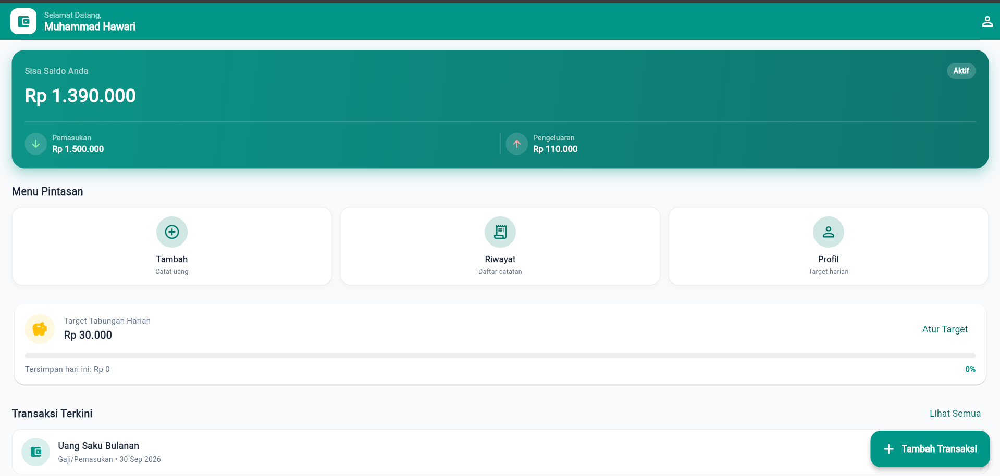
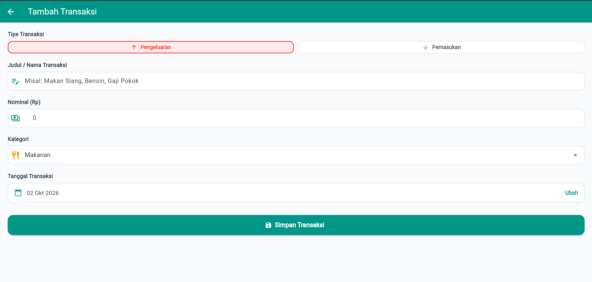
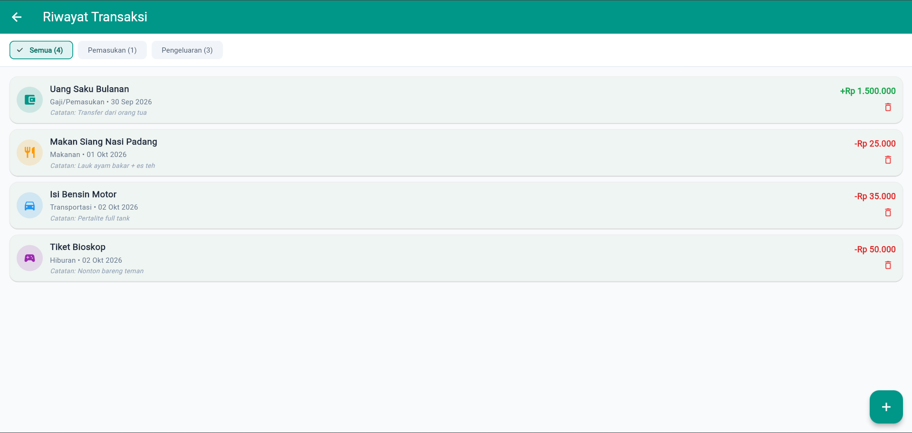
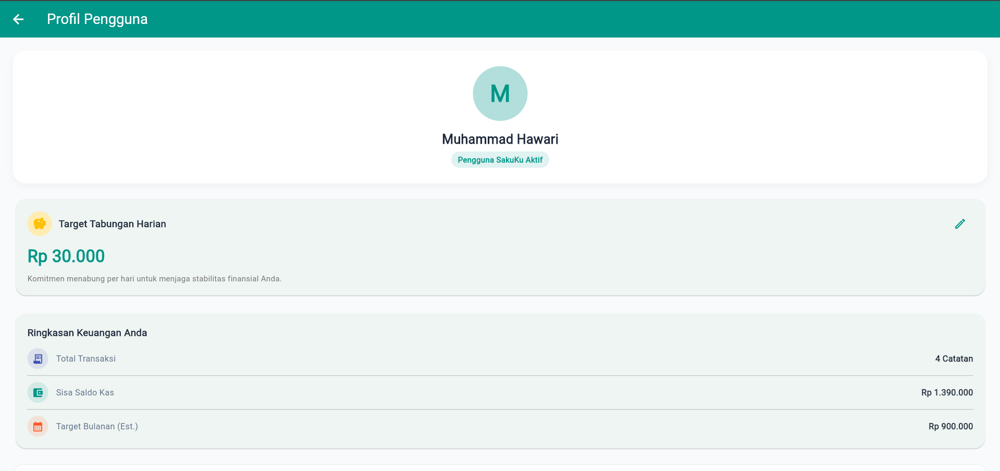
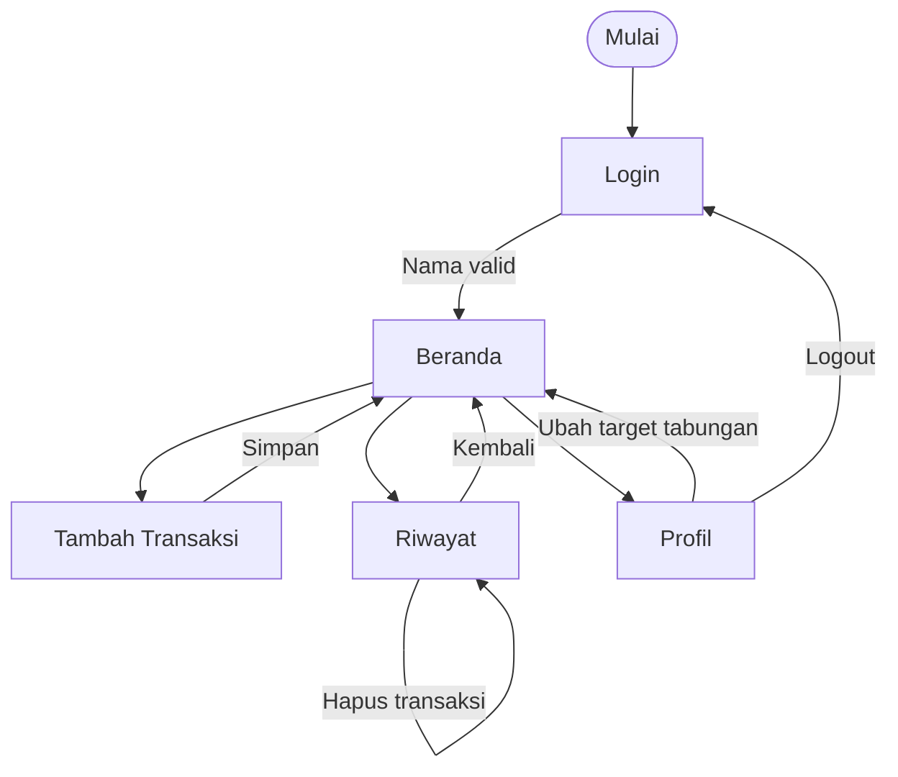

<div align="center">

# 💰 SakuKu

**Aplikasi pencatat keuangan harian berbasis Flutter**

Catat pemasukan dan pengeluaran, pantau saldo, dan capai target tabungan harianmu.


</div>

---

## 📖 Tentang Aplikasi

**SakuKu** dibuat untuk membantu mahasiswa dan anak kos mengatur uang saku bulanan. Banyak orang kehabisan uang sebelum akhir bulan karena tidak tahu ke mana uangnya pergi. SakuKu membuat pencatatan jadi cepat: cukup beberapa ketukan untuk menambah transaksi, lalu saldo dan riwayat langsung diperbarui.

Proyek ini dibuat sebagai **Tugas Kelompok Perancangan Aplikasi Mobile Berbasis Flutter** (TI 3E, Politeknik Negeri Lhokseumawe) dan bersifat **open source**.

### 🎯 Masalah dan Tujuan

| Masalah | Solusi SakuKu |
|---|---|
| Pengeluaran kecil tidak tercatat dan tahu-tahu uang habis | Pencatatan cepat lewat tombol pintasan dan tombol mengambang |
| Sulit melihat sisa uang secara ringkas | Kartu saldo berisi total pemasukan, pengeluaran, dan sisa saldo |
| Tidak ada motivasi untuk menabung | Target tabungan harian dengan progress bar |

### 👥 Target Pengguna
Mahasiswa, pelajar, dan siapa pun yang ingin mencatat keuangan harian dengan cara sederhana.

---

## ✨ Fitur Utama

- 🔐 **Login sederhana**: masuk dengan nama pengguna (validasi minimal 3 karakter).
- 📊 **Ringkasan saldo**: sisa saldo, total pemasukan, dan total pengeluaran dalam satu kartu.
- ➕ **Tambah transaksi**: pilih pemasukan atau pengeluaran, isi judul, nominal, kategori, tanggal, dan catatan.
- 🔢 **Input nominal otomatis berformat**: ketik `10000` langsung tampil `10.000`.
- 🧾 **Riwayat transaksi**: daftar lengkap dengan filter *Semua / Pemasukan / Pengeluaran*.
- 🗑️ **Hapus transaksi** dengan dialog konfirmasi.
- 🐷 **Target tabungan harian**: atur target dan pantau progress bar di beranda.
- 👤 **Profil**: ubah target tabungan dan keluar (logout).

---

## 📱 Halaman

| No | Halaman | Route | Fungsi |
|---|---|---|---|
| 1 | Login | `/login` | Masuk dengan nama pengguna |
| 2 | Beranda | `/home` | Ringkasan saldo, menu pintasan, target tabungan, transaksi terkini |
| 3 | Tambah Transaksi | `/tambah` | Form pencatatan pemasukan atau pengeluaran |
| 4 | Riwayat | `/riwayat` | Daftar transaksi, filter, dan hapus |
| 5 | Profil | `/profil` | Atur target tabungan dan logout |

---

## 🖼️ Tampilan

<!-- Letakkan screenshot di folder screenshots/ lalu pastikan nama filenya sama dengan di bawah -->

| Beranda | Tambah Transaksi |
|:---:|:---:|
|  |  |

| Riwayat | Profil |
|:---:|:---:|
|  |  |

---

## 🔄 Alur Pengguna (User Flow)



---

## 🏗️ Arsitektur dan Teknologi

- **Framework:** Flutter (Dart), UI Material 3 dengan tema teal
- **State management:** *Singleton* `AppData` yang mewarisi `ChangeNotifier`, dibaca di UI memakai `ListenableBuilder` (pola Observer)
- **Navigasi:** *Named routes* (`Navigator.pushNamed`, `pushReplacementNamed`, `pushNamedAndRemoveUntil`)
- **Tanpa dependensi eksternal:** format Rupiah dan tanggal dibuat sendiri
- **Platform:** Web (Chrome), dapat dijalankan juga di Android dan lainnya

### 📂 Struktur Folder

```
lib/
├── main.dart                  # Titik masuk aplikasi, tema, dan daftar route
├── data/
│   └── app_data.dart          # State management lokal + helper format
├── models/
│   └── transaction_model.dart # Model data transaksi
├── pages/
│   ├── login_page.dart
│   ├── home_page.dart
│   ├── add_transaction_page.dart
│   ├── history_page.dart
│   └── profile_page.dart
├── utils/
│   └── rupiah_input_formatter.dart  # Format titik ribuan otomatis
└── widgets/
    └── app_logo.dart                # Logo SakuKu
```

---

## 🚀 Cara Menjalankan

### Prasyarat
- [Flutter SDK](https://docs.flutter.dev/get-started/install)
- Browser Chrome (untuk menjalankan versi web)
- Git (untuk clone) dan VS Code atau Android Studio

### Langkah-langkah

1. **Clone repository**
   ```bash
   git clone https://github.com/hawari-95/SakuKu_Flutter.git
   cd SakuKu_Flutter
   ```
   *Atau* klik tombol hijau **Code → Download ZIP**, lalu ekstrak.

2. **Unduh dependensi**
   ```bash
   flutter pub get
   ```

3. **Jalankan aplikasi**
   ```bash
   flutter run -d chrome
   ```

4. Login dengan nama bebas (minimal 3 karakter), lalu mulai mencatat. 🎉

### Perintah lain yang berguna

```bash
flutter doctor            # cek kesiapan lingkungan Flutter
flutter test              # jalankan pengujian
flutter build web         # build versi web (hasil di build/web)
flutter build apk         # build APK Android
```

---

## ⚠️ Keterbatasan dan Rencana Pengembangan

- Data masih disimpan **di memori**, jadi hilang saat halaman di-refresh.
- Belum ada autentikasi sungguhan (login hanya memakai nama pengguna).

Rencana ke depan:

- [ ] Penyimpanan permanen (`shared_preferences` atau SQLite)
- [ ] Grafik pengeluaran per kategori
- [ ] Ekspor laporan ke PDF atau CSV
- [ ] Mode gelap
- [ ] Pengingat harian untuk mencatat transaksi

---

## 🤝 Kontribusi

Proyek ini terbuka untuk siapa saja.

1. *Fork* repository ini
2. Buat branch baru: `git checkout -b fitur-baru`
3. *Commit* perubahanmu: `git commit -m "Tambah fitur baru"`
4. *Push* ke branch: `git push origin fitur-baru`
5. Buka **Pull Request**

---

## 👨‍💻 Tim

| Nama | Peran |
|---|---|
| Muhammad Hawari | Pengembang |
|  | Rahmat Hidayat | Ide Pokok & pengembang

---

## 📄 Lisensi

Dirilis di bawah [MIT License](LICENSE). Bebas dipakai, diubah, dan dibagikan dengan tetap mencantumkan hak cipta.

<div align="center">

Dibuat dengan 💙 menggunakan Flutter

</div>
